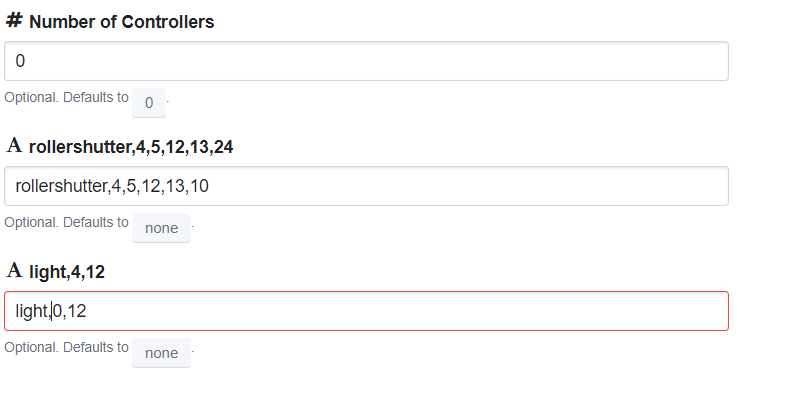

# HOME IOT
Device controller for ESP8266 using  [Homie framework](http://example.com). 

Tested in electrodragon boards:

https://www.electrodragon.com/product/wifi-iot-relay-board-based-esp8266/

Support select nodes by configuration. One firmware for all devices, no need to have one firmare for each combination of nodes.

In configuration mode:
* Select the number of nodes
* For each node
  * Input string comma separated for configuration the node.

Sample:

Nodes supported:
* Light -> Control light nodes. Fisical button supported
  * node -> light
  * attributes
    * power -> true/false
  * configuration -> light,button,output
    * button-> pin where fisical button has connected.
    * output -> pin where fisical light
  * sample -> light,4,12
* Rollershutter-> Control rollershuter nodes. Fisical buttons supported
  * node -> rollershutter
  * attributes
    * level -> 0:100. 255 for stop
  * configuration -> rollershutter,buttonUP,buttonDOWN,outputUP,outputDOWN
    * buttonXX-> pin fisical button
    * outputXX -> pin fisical shutter 
  * sample -> light,4,12
 
 Other features:
 * NTP synchronization.
 * Logging support